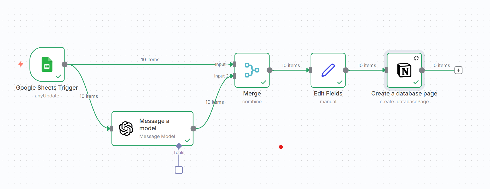
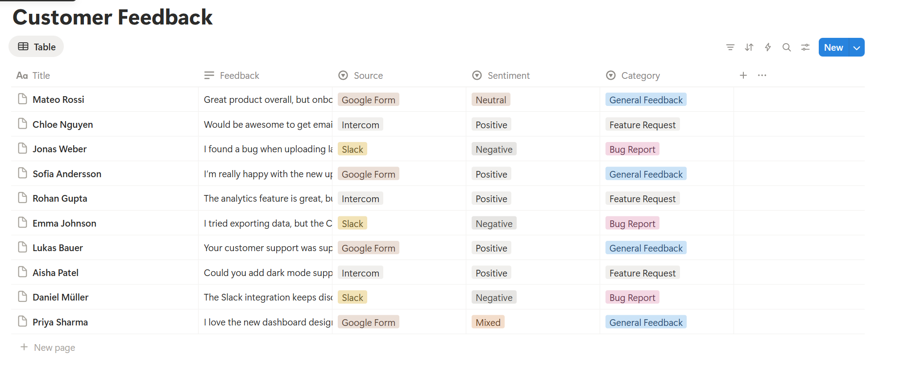

# 🧠 Customer Feedback Sentiment Analysis (n8n + Notion)

This project automates **sentiment analysis on customer feedback** and stores the structured results in a **Notion database** using [n8n](https://n8n.io).  
It demonstrates how to combine AI, automation, and structured data management to improve insight collection.

**n8n workflow**

---

## 🚀 Overview

The workflow performs the following steps:

1. **Collect feedback** from multiple sources (e.g., Google Forms, Slack, Intercom, etc.)
2. **Analyze sentiment & categorize** each entry using an AI model (*Positive*, *Negative*, *Neutral*, or *Mixed*)
3. **Store all results in Notion** — creating one page per feedback entry with key details:
   - Name  
   - Feedback text  
   - Source  
   - Sentiment  
   - Category  

This turns raw feedback into actionable insights — allowing teams to review and prioritize feedback efficiently.

---

## 📊**Result in Notion**

